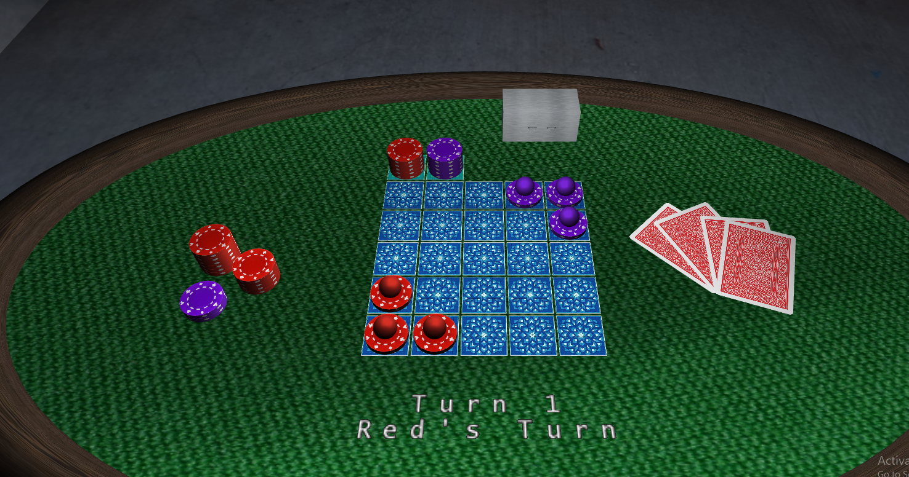
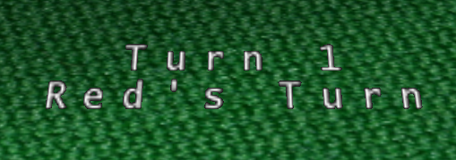

# LAIG 2020/2021

## Group T3G02
| Name             | Number    | E-Mail               |
| ---------------- | --------- | -------------------- |
| Ricardo Fontão   | 201806317 | up201806317@up.pt |
| Tiago Silva      | 201806516 | up201806516@up.pt |

----

## Projects

### [TP1 - Scene Graph](TP1)

- [Scene](TP1/scenes/LAIG_TP1_XML_T3_G02_v02.xml)
- A portal 2 test chamber (to those who love the game the XML should have a nice surprise at the start), featuring many different and detailed props:
  - Cube dropper
  - Cubes
  - Doors
  - Turrets
  - Hard light bridge
  - Piston platform
- The walls use texture amplification to use the same texture file containing a single "tile" to be repeated.
- Parser with a very extensive error checking and correction, giving detailed logs when something is wrong and fixing the problem the best it can.

-----

### [TP2 - Complex Surfaces](TP2)

Ignoring features present TP1:
- Animation that shows a cube falling and then getting caught by the hard light bridge
- A detailed portal gun using 6 precise NURBS patches
- Added transparency to the scene in the hard light bridge and portals
- Animated portals
- A deadly turret comments on how it misses you
- The spritetext detects \n characters (&#10; in XML) and adapts

#### Highlights:

----

### [TP3 - Mitsudomoe Board Game](TP3)
- Communication with the Prolog Server
- Switch between different scenes with one click
- Various gamemodes can be chosen through the GUI
- Piece movement is animated
- Changes of cameras are animated
- Replay of a game movie
- Undo moves through button in the scene
- Adjustable turn timer
- Turn counter
- Everything can be costumized on the scene file (including pieces and tile aspect) except for the board layout

### Highlights:

