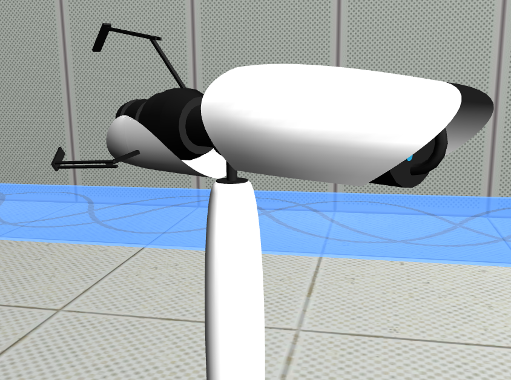
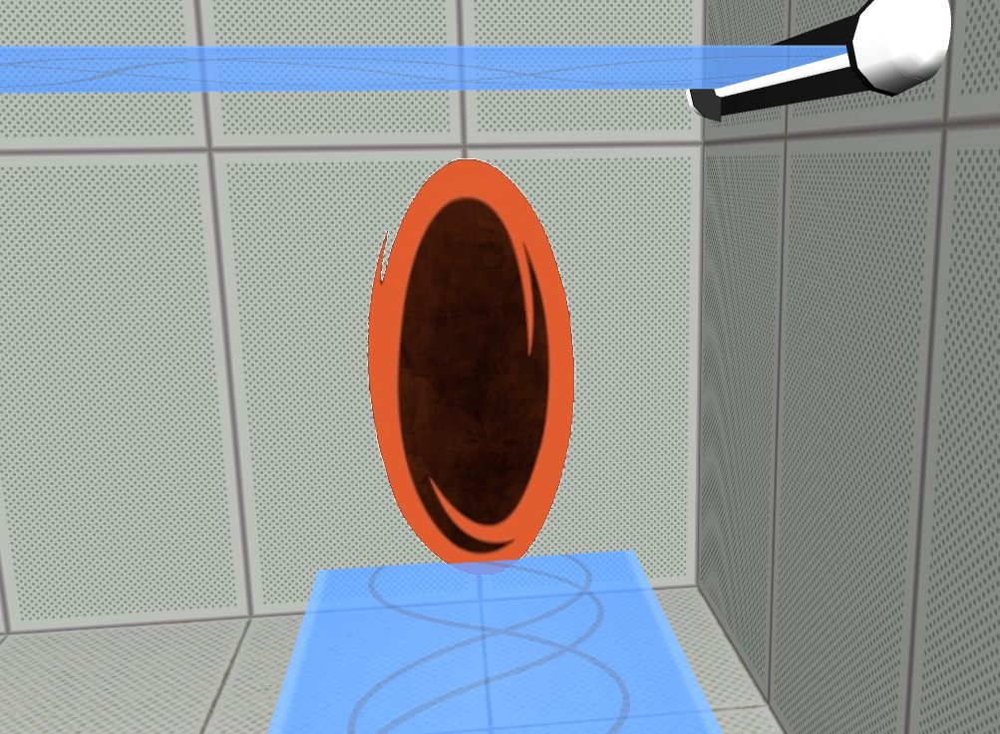

# LAIG 2020/2021 - TP3

## Group T3G02
| Name             | Number    | E-Mail               |
| ---------------- | --------- | -------------------- |
| Ricardo Fontão   | 201806317 | up201806317@fe.up.pt |
| Tiago Silva      | 201806516 | up201806516@fe.up.pt |
----
## Project information

- Communication with the Prolog Server
- Switch between different scenes with one click
- Various gamemodes can be chosen through the GUI
- Piece movement is animated
- Changes of cameras are animated
- Replay of a game movie
- Undo moves through button in the scene
- Adjustable turn timer
- Turn counter
- Everything can be costumized on the scene file (including pieces and tile aspect) except for the board layout

### Highlights:

----
## Issues/Problems

- In the camera animation, if the 
